# 利用加强版RFM模型挖掘b站优质up主
## 项目概况
### 分析目的
本项目通过对2019年科技区发布的所有视频进行分析，在RFM模型的基础上，尝试使用更符合b站特性的IFL模型，挑选出视频质量高，值得关注的up主。
### 数据来源
分析数据均基于bilibili 网站上的公开信息，主要有以下数据维度：  
2019年度，科技区播放量超过5w视频的**分区名称、作者名称、作者id、发布时间、播放数、硬币数、弹幕数、收藏数、点赞数、分享数、评论数**，共计50130行。

## 数据概览
### 数据表
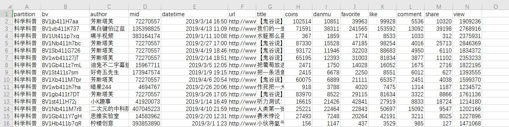 
**关键指标解释**  
coins：投硬币数  
danmu：弹幕数  
favorite：收藏数  
like：点赞数  
comment：评论数  
share：分享数  
view：播放量  

### 各字段数量统计
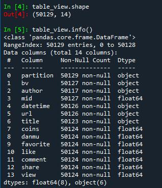 

### 缺失值统计
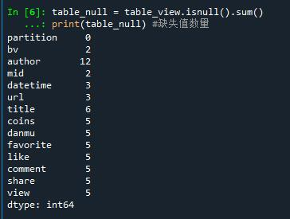 

## 数据清洗
### 删除空值和重复值

```python
table_view = table_view.dropna() #删除空值
table_view = table_view.drop_duplicates() #删除重复值
```

  
共删除1330行数据，剩余数据量**48799**行

### 提取构建模型所需的指标
```python
table_view = table_view[['partition','author','datetime','view','danmu','comment','like','coins','favorite','share']] #提取指标
```

## 数据建模
### 模型介绍
RFM模型是衡量客户价值和客户创利能力的重要工具和手段。在众多的客户关系管理(CRM)的分析模式中，RFM模型是被广泛提到的。通过一个客户近期购买行为、购买的总体频率以及消费金额三项指标来描述客户的价值状况。  
R：最近一次消费时间（最近一次消费到参考时间的间隔）  
F：消费的频率(消费了多少次）  
M：消费的金额 （总消费金额）  
但RFM模型并不能评价视频的质量，所以在这里针对up主的视频信息构建了IFL模型，以评估视频的质量。  

**I(Interaction_rate)：**  
I值反映的是平均每个视频的互动率，互动率越高，表明其视频更能产生用户的共鸣，使其有话题感。  
**I = （总弹幕数+总评论数） / 总播放量 / 统计范围内视频数量**  

**F(Frequence)：**  
F值表示的是每个视频的平均发布周期，每个视频之间的发布周期越短，说明内容生产者创作视频的时间也就越短，创作时间太长，不是忠实粉丝的用户可能将其遗忘。  
**F = （统计时间内最晚发布视频时间-最早发布视频时间）/ 发布视频数量**  

**L(Like_rate)：**  
L值表示的是统计时间内发布视频的平均点赞率，越大表示视频质量越稳定，用户对up主的认可度也就越高。  
**L = （点赞数x1+投币数x2+收藏数x3+分享数x4）/ 播放量 / 发布视频数**

### 对科技区进行分区
根据不同的分区进行IFL打分，这里以数据量最多的**社科人文**为例  

```python
table_sc = table_view.loc[table_view['partition']=='科学科普']
table_la = table_view.loc[table_view['partition']=='社科人文']
table_ma = table_view.loc[table_view['partition']=='机械']
table_tec = table_view.loc[table_view['partition']=='野生技术协会']
table_mi = table_view.loc[table_view['partition']=='星海'] # 一般发布军事内容
table_car = table_view.loc[table_view['partition']=='汽车']
```

### 指标构造
#### 构建F值  
首先，先筛选出发布视频大于5的up主，视频播放量在5W以上的视频数少于5，说明可能是有些视频标题取得好播放量才高，而不是视频质量稳定的up主。  

```python
la_count = round(table_la.groupby('author')['datetime'].count()).reset_index() #计算发布视频的次数
la_count.columns = ['author','times'] 

la_count_5 = la_count[la_count['times']>5] #剔除掉发布视频数小于5的up主
la_count_5.info()
```
  
筛选完之后只剩余509个up主视频数在5个以上。

```python
la_datetime_last = table_la.groupby('author')['datetime'].max()
la_datetime_late = table_la.groupby('author')['datetime'].min()
# F值 =(最晚发布日期 - 最早发布日期) / 发布次数 ，保留整数
la_F = round((la_datetime_last-la_datetime_late).dt.days/table_la.groupby('author')['datetime'].count()).reset_index()
la_F.columns = ['author','F']
la_F = pd.merge(la_count_5,la_F,on = 'author',how = 'inner')
```

通过对F值升序排列发现，存在部分up主最晚发布日期与最早发布日期为0的现象，猜测是在同一天内发布了大量的视频。

  

通过访问主页发现，其视频均为转载，将F值为0的up主剔除统计范围。  

  

```python
la_F = la_F.loc[la_F['F']>0] #剔除一天发布很多视频的up主
```
#### 构建I值  
```python
la_danmu = table_la.groupby('author')['danmu'].sum()
la_comment = table_la.groupby('author')['comment'].sum()
la_view = table_la.groupby('author')['view'].sum()
la_count = table_la.groupby('author')['datetime'].count()

# I值 = (总弹幕数+总评论数)/总播放量/统计范围内视频数量
la_I = round((la_danmu+la_comment)/la_view/la_count*100,2).reset_index()
la_I.columns = ['author','I']
la_F_I = pd.merge(la_F,la_I,on = 'author',how = 'inner')
```

#### 构建L值  
```python
table_la['L'] = (table_la['like']+table_la['coins']*2+table_la['favorite']*3+table_la['share']*4)/table_la['view']*100 #计算每个视频的L值

la_L = (table_la.groupby('author')['L'].sum()/table_la.groupby('author')['datetime'].count()).reset_index()
la_L.columns = ['author','L']
la_L = round(la_L,2)

la_IFL = pd.merge(la_F_I,la_L,on = 'author',how = 'inner')
la_IFL['partition'] = '社科人文' #打上标签
la_IFL = la_IFL[['partition','author','I','F','L']]
```

将构建的指标合并为新的模型，一个初级的IFL模型就初步完成了~  

  

按照社科人文构建IFL模型的方式，将剩余的五个分区也全都构建完成，按分区不同整理至一起，共有1282行有效数据。
```python
IFL = pd.concat([la_IFL,sc_IFL,ma_IFL,tec_IFL,mi_IFL,car_IFL],ignore_index=True)
```
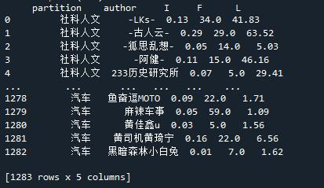  


### 维度打分
维度确认的核心是分值确定，按照设定的标准，我们给每个消费者的I/F/L值打分，分值的大小取决于我们的偏好，**即我们越喜欢的行为，打的分数就越高：**  
* I值，I代表了up主视频的平均评论率，这个值越大，就说明其视频越能使用户有话题，当I值越大时，分值越大。
* F值表示视频的平均发布周期，我们当然想要经常看到，所以这个值越大时，分值越小。
* L值表示发布视频的平均点赞率，S值越大时，质量越稳定，分值也就越大。I/S值根据四分位数打分，F值根据更新周期打分。  
利用pandas中的**describe()** 参数对IFL模型进行描述性统计，将I值和L值按照区间分为不同的维度  

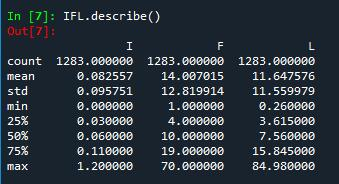  

**I值打分：**

I打分  | I值  | 含义
 ---- | ----- | ------  
 1  | [0,0.03) | 互动率大于等于0小于0.03% 
 2  | [0.03,0.06) | 互动率大于等于0.03%小于0.06%  
 3  | [0.06,0.11) | 互动率大于等于0.06%小于0.11% 
 4  | [0.11,∞) | 互动率大于等于0.11%  

**F值根据发布周期打分：**  

F打分  | F值  | 含义
 ---- | ----- | ------  
 1  | [90,∞) | 超过三个月以上更新 
 2  | [30，90) | 平均三个月更新一次  
 3  | [15,30) | 平均一个月更新一次 
 4  | [7,15) | 平均半月更新一次  
 5  | [1,7) | 平均每周更新一次  
 
 **L值打分：**
 
 I打分  | I值  | 含义
 ---- | ----- | ------  
 1  | [0,3.62) | 视频点赞率大于等于0小于3.62% 
 2  | [3.62,7.56) | 互动率大于等于3.62%小于7.56%  
 3  | [7.56,15.85) | 互动率大于等于7.56%小于15.85% 
 4  | [15.85,∞) | 互动率大于等于15.85%  
 
### 分值计算
 
 ```python
IFL['I_SCORE'] = pd.cut(IFL['I'], bins=[0,0.03,0.06,0.11,1000],labels=[1,2,3,4], right=False).astype(float)
IFL['F_SCORE'] = pd.cut(IFL['F'], bins=[0,7,15,30,90,1000],labels=[5,4,3,2,1], right=False).astype(float)
IFL['L_SCORE'] = pd.cut(IFL['L'], bins=[0,3.62,7.56,15.85,1000],labels=[1,2,3,4], right=False).astype(float)

# bins参数代表我们按照什么区间进行分组
# labels和bins切分的数组前后呼应,给每个分组打标签
# right表示了右侧区间是开还是闭，即包不包括右边的数值，如果设置成False，就代表[0,30)
 ```  
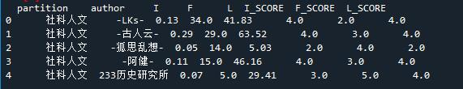  

判断用户分值是否大于平均值：  
```python
#判断用户的分值是否大于平均值
# 1为大于平均值，0为小于平均值

IFL['I是否大于平均值'] =(IFL['I_SCORE'] > IFL['I_SCORE'].mean()) *1
IFL['F是否大于平均值'] =(IFL['F_SCORE'] > IFL['F_SCORE'].mean()) *1
IFL['L是否大于平均值'] =(IFL['L_SCORE'] > IFL['L_SCORE'].mean()) *1
```  
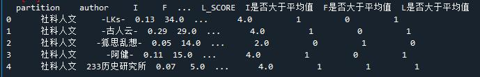  

### 客户分层
RFM经典的分层会按照R/F/M每一项指标是否高于平均值，把用户划分为8类，我们根据案例中的情况进行划分，如下表格所示：  

  用户分类  | I值是否大于平均值  | F值是否大于平均值 | L值是否大于平均值 | 备注 
  ---- | ----- | ------ | ------- | --------   
  高价值up主  | 1 | 1 | 1 | 用户活跃高，更新周期短，视频质量高  
  高价值拖更up主  | 1 | 0 | 1 |  用户活跃高，更新周期长，视频质量高 
  高质量内容高深up主  | 0 | 1 | 1 |  用户活跃低，更新周期短，视频质量高 
  高质量内容高深拖更up主  | 0 | 0 | 1 |  用户活跃低，更新周期长，视频质量高 
  接地气活跃up主  | 1 | 1 | 0 | 用户活跃高，更新周期短，视频质量低  
  活跃up主  | 0 | 1 | 0 | 用户活跃低，更新周期短，视频质量低  
  接地气up主  | 1 | 0 | 0 | 用户活跃高，更新周期长，视频质量低  
  还在成长中up主  | 0 | 0 | 0 | 用户活跃低，更新周期长，视频质量低  
 
引入人群数值的辅助列，把之前判断的I\F\S是否大于均值的三个值串联起来：  
```python
IFL['人群数值'] =(IFL['I是否大于平均值'] *100) +(IFL['F是否大于平均值'] *10) +(IFL['L是否大于平均值'] *1)
```
 
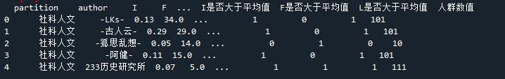  

构建判断函数**transform_label()** ，通过判断人群数值的值，来返回对应的标签
```python
def transform_label(x):
    if x == 111:
        label = '高价值up主'
    elif x == 101:
        label = '高价值拖更up主'
    elif x == 11:
        label = '高质量内容高深up主'
    elif x == 1:
        label = '高质量内容高深拖更up主'
    elif x == 110:
        label = '接地气活跃up主'
    elif x == 10:
        label = '活跃up主'
    elif x == 100:
        label = '接地气up主'
    elif x == 0:
        label = '还在成长的up主'
    return label
```

将标签分类函数应用到人群数值列：
```python
IFL['人群类型'] = IFL['人群数值'].apply(transform_label) 
```
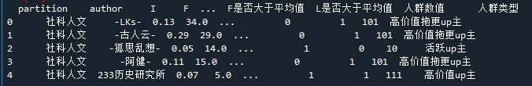  

### 统计各类人数占比
按照人群类型进行分类，统计出每个类型的up主占总人数的比值
```python
account = IFL['人群类型'].value_counts().reset_index()
account['人数占比'] = account['人群类型'] / account['人群类型'].sum()
```

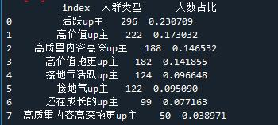 

将统计数据通过扇形统计图的方式进行可视化呈现

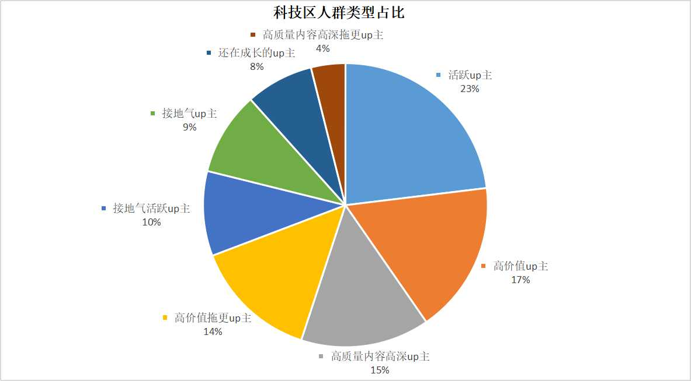 

## 数据分析与可视化呈现
### 各分区高价值up主占比统计

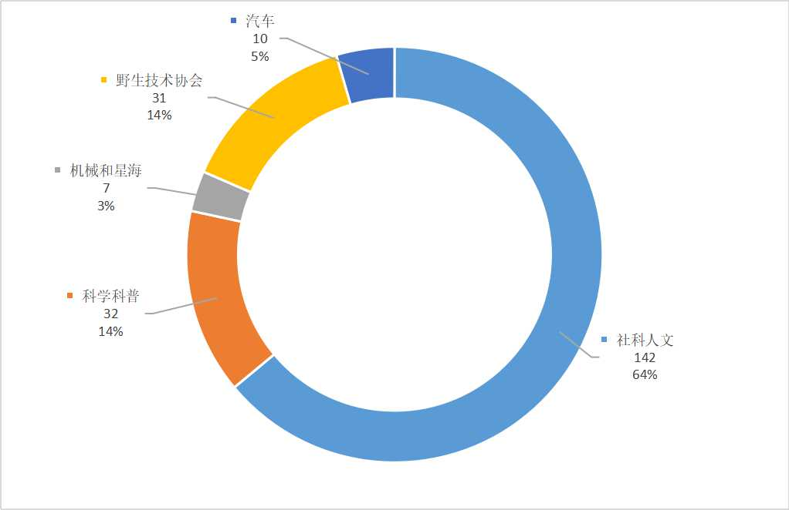  

由于星海区和机械区分别只有2位和5位up主为高价值up主，为了环状图的美观性，把两个分区合并在一起统计  
从图中可知，社科人文分区中高价值up主在所有分区中占比**64%** ，位列第一  

### 各分区up主排行top15
选取各个分区的高质量up主，并通过点赞率进行降序排列，选取出各个分区排名前15的up主  

#### 社科人文分区
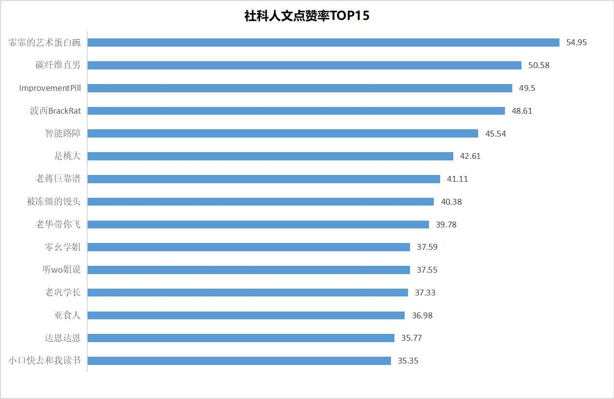  

#### 科学科普分区
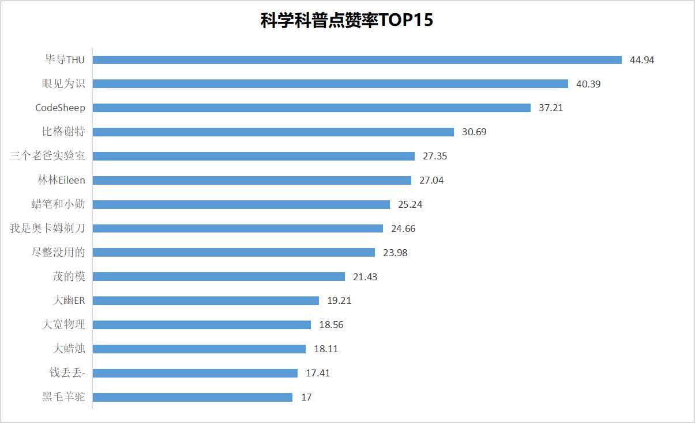  

#### 野生技术协会分区
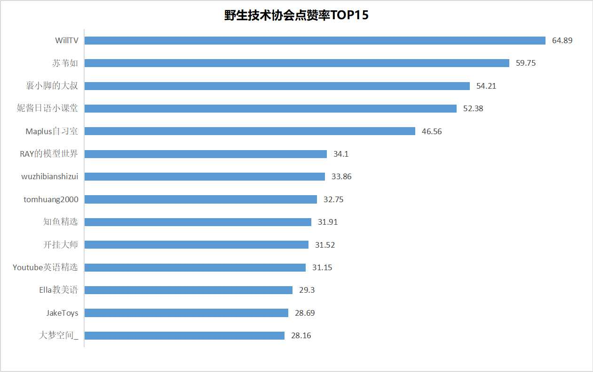  

#### 汽车分区
由于汽车分区高质量up主仅有10位，所以对10位优质up主进行排序  

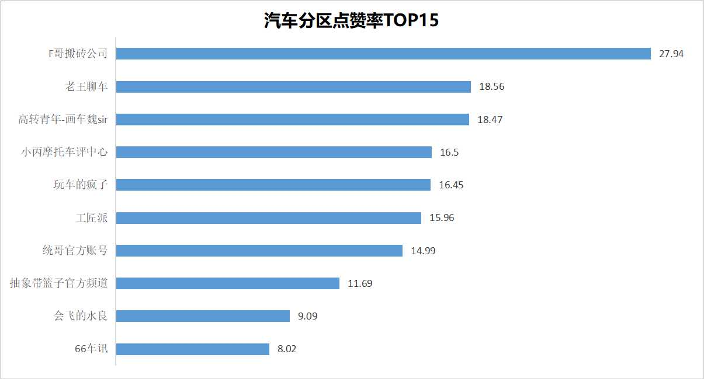  

#### 星海和机械分区
由于这两个分区up主较少，所以对所有up主进行排序  

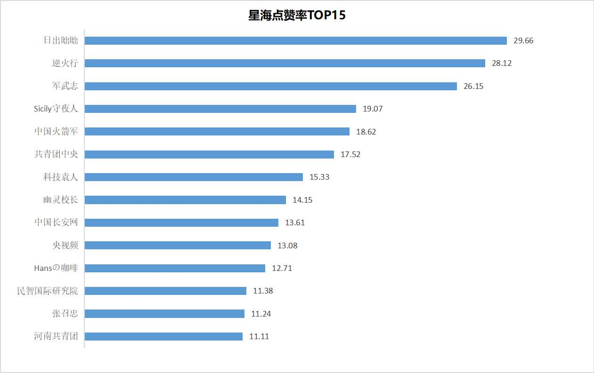  

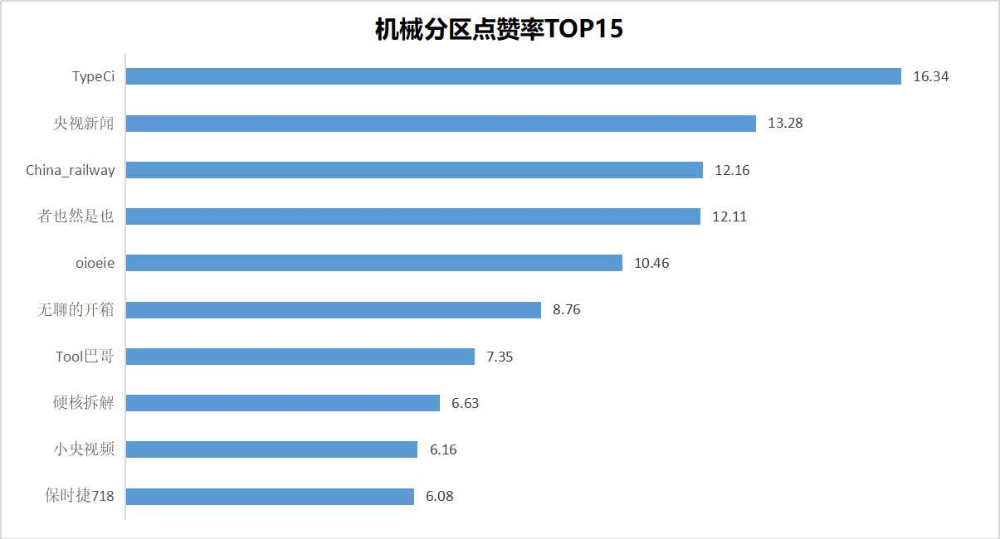  


**参考文章：  
1.数据不吹牛:《不到70行Python代码，轻松玩转RFM用户分析模型》  
2.Crossin:《B站用户行为分析非官方报告》  
3.https://github.com/Vespa314/bilibili-api/blob/master/api.md
